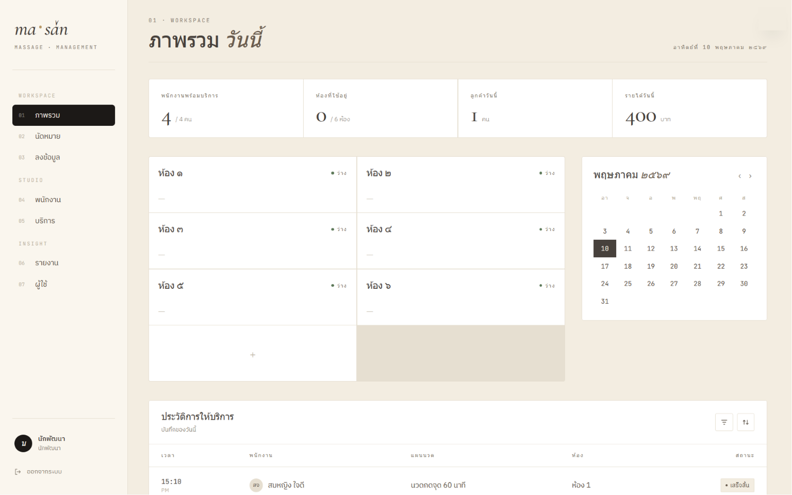

# MaS — Massage Administration System

A web-based administration system for Thai massage parlors — role-based access (Admin / Secretary) with a sidebar layout.

## Screenshots



## Features

- **Role-based Access**: Admin and Secretary roles with separate page visibility and route protection.
- **Dashboard**: Today's overview — stat cards and live room availability grid.
- **Appointments**: Booking form, staff assignment, and status tracking (Admin only).
- **Entry**: Secretary records completed service sessions.
- **Staff Management**: Staff profiles and skill tags.
- **Service Management**: Service cards with price, duration, and active status.
- **Reports**: Monthly revenue charts and payroll summaries (Secretary only).

## Installation

1. **Clone the Repository**
   ```bash
   git clone https://github.com/NsamaX/Massage-Administration-System.git
   ```

2. **Prerequisites**
   - Node.js (LTS recommended)
   - XAMPP (with MySQL / MariaDB enabled)

3. **Set Up**
   Start MySQL in XAMPP, then create a database named `mas` via phpMyAdmin.

   Install dependencies:
   ```bash
   npm install
   ```

4. **Run**
   ```bash
   npm run dev
   ```
   Open [http://localhost:3000](http://localhost:3000) in your browser.

## Demo

| Role  | PIN  |
|-------|------|
| Dev   | 0000 |
| Admin | 1111 |
| Staff | 2222 |

## License

This project is licensed under the **MIT License**.
